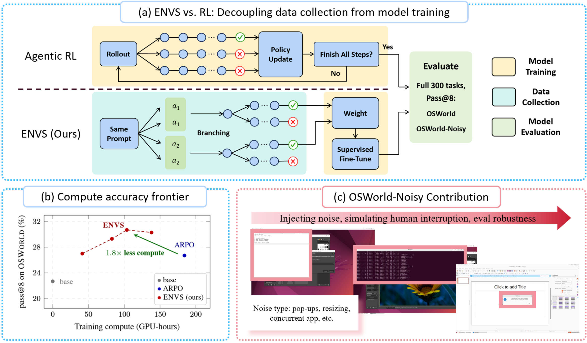
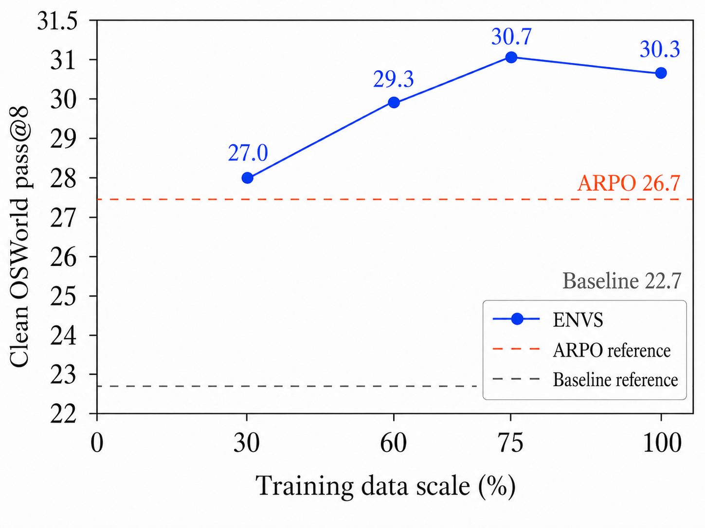
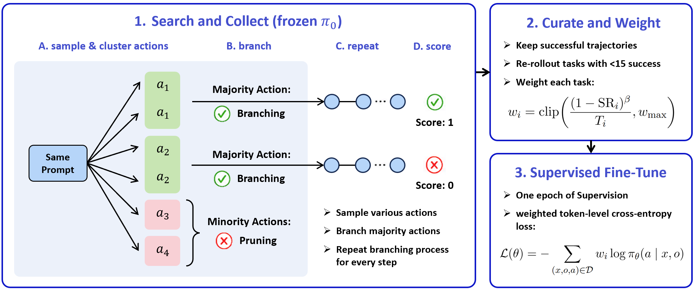

<h1 align="center">ENVS: Environment-Native Verified Search for Long-Horizon GUI Agents</h1>

<div align="center">

Yincheng Zhou<sup>1,&ast;</sup>, Athena Zhuoming Zhong<sup>1,&ast;</sup>, Shijie Zhang<sup>2,&ast;</sup>, Kevin Zhang<sup>2</sup>, Teresa Xiaotao Shang<sup>1</sup>, Shanghang Zhang<sup>2,&dagger;</sup>

<sup>1</sup>University of Pennsylvania &nbsp;&nbsp; <sup>2</sup>Peking University

<sup>&ast;</sup>Equal contribution &nbsp;&nbsp; <sup>&dagger;</sup>Corresponding author

</div>

<p align="center">
  <a href="#"></a>
  <a href="LICENSE"></a>
  
  
</p>

<p align="center">
  
</p>

**ENVS** treats the GUI environment itself as a source of supervision. Instead of optimizing a policy with on-policy RL rollouts, ENVS **searches** live OSWorld desktop VMs to discover successful trajectories, **verifies** them with the environment oracle, and **trains** a GUI agent with one-epoch SFT on globally balanced step-level supervision. It reaches **higher accuracy at lower compute** than matched online RL, and we release **OSWorld-Noisy**, a benchmark of recoverable desktop interruptions for testing robustness.

---

## Highlights

- **Decoupled search-then-train.** Trajectory *discovery* (environment-native tree search) is separated from policy *optimization* (one-epoch SFT) — no rollouts inside the training loop.
- **Branch only on behaviorally distinct actions.** At each step ENVS samples candidate actions, fingerprints them, and explores the **top-*k* highest-agreement (majority)** behaviors while pruning minority ones — turning a costly search into a tractable budgeted tree.
- **Verified, globally balanced supervision.** Only oracle-verified successful leaves become training data, reweighted by task difficulty and deduplicated across shared prefixes.
- **Stronger and cheaper than online RL.** **30.3 pass@8** on OSWorld vs. 26.7 for matched ARPO, at **138–153 GPU-h** vs. 184–192. With only **30%** of the search data, ENVS still reaches **27.0**.
- **OSWorld-Noisy.** A new benchmark of **151 runtime noise generators** (3 tiers) that inject realistic, *recoverable* desktop interruptions while preserving the original tasks and evaluators.

---

## Results

**OSWorld — pass@8 (%)**, base model UI-TARS-1.5-7B. *Trained* = 86-task subset, *Held-out* = 214 tasks.

<table align="center">
<thead>
<tr><th>Method</th><th align="right">Trained (86)</th><th align="right">Held-out (214)</th><th align="right">Overall (300)</th></tr>
</thead>
<tbody>
<tr><td>UI-TARS-1.5-7B (base)</td><td align="right">73.3</td><td align="right">2.3</td><td align="right">22.7</td></tr>
<tr><td>+ ARPO (online RL)</td><td align="right">81.4</td><td align="right">4.7</td><td align="right">26.7</td></tr>
<tr><td><b>+ ENVS (ours)</b></td><td align="right"><b>87.2</b></td><td align="right"><b>7.5</b></td><td align="right"><b>30.3</b></td></tr>
</tbody>
</table>

**OSWorld-Noisy — pass@8 (%)**

<table align="center">
<thead>
<tr><th>Method</th><th align="right">Trained (86)</th><th align="right">Held-out (214)</th><th align="right">Overall (300)</th></tr>
</thead>
<tbody>
<tr><td>UI-TARS-1.5-7B (base)</td><td align="right">66.3</td><td align="right">1.9</td><td align="right">20.3</td></tr>
<tr><td>+ ARPO (noisy)</td><td align="right">62.8</td><td align="right">5.1</td><td align="right">21.7</td></tr>
<tr><td><b>+ ENVS (noisy, ours)</b></td><td align="right"><b>88.4</b></td><td align="right">5.1</td><td align="right"><b>29.0</b></td></tr>
</tbody>
</table>

**Compute (total GPU-hours)** — ENVS reports collection and training separately; ARPO collects inside the training loop.

<table align="center">
<thead>
<tr><th>Method</th><th align="right">Collect</th><th align="right">Train</th><th align="right">Total</th></tr>
</thead>
<tbody>
<tr><td>ARPO (clean / noisy)</td><td align="right">—</td><td align="right">—</td><td align="right">184 / 192</td></tr>
<tr><td><b>ENVS (clean / noisy)</b></td><td align="right">107 / 121</td><td align="right">31 / 32</td><td align="right"><b>138 / 153</b></td></tr>
</tbody>
</table>

**Data efficiency.** 30% of the collected trajectories already reaches **27.0** pass@8 (≈ ARPO at full budget); gains saturate near the full dataset (**30.3**). Training from noisy environments also better preserves auxiliary visual reasoning, e.g. OSWorld-G Refusal **16.7 vs. 1.9** and BLINK Functional Correspondence **26.2 vs. 23.1**.

<p align="center">
  
</p>

---

## Method

<p align="center">
  
</p>

ENVS runs in two decoupled phases.

**1. Environment-native verified search (collection).** For each task, many identical OSWorld VMs are reset to the same initial state. Starting from a frozen policy, at each node ENVS samples candidate next actions, reduces each to a coarse **behavior fingerprint** (action type + discretized arguments), and buckets candidates by fingerprint. The **top-*k* highest-agreement buckets are the *majority* actions and are explored**; all lower-ranked buckets are *minority* actions and are pruned. The highest-agreement action continues on the parent VM, while the remaining majority actions spawn child VMs that replay the shared prefix and branch. After search, every leaf trajectory is scored by the **OSWorld task oracle** (binary reward $R(\tau) \in \{0, 1\}$); only verified successes are kept.

**2. Curation + one-epoch SFT (training).** Verified trajectories are decomposed into per-step supervised examples, **deduplicated** over shared prefixes (each shared step trained once), and **reweighted** by a difficulty-aware per-task weight that shifts gradient mass toward hard tasks and normalizes for trajectory length. The agent is then fine-tuned for a **single epoch**.

$$w_i = \mathrm{clip}\left(\frac{(1-\mathrm{SR}_i)^{\beta}}{T_i}, w_{\max}\right)$$

### OSWorld-Noisy

OSWorld-Noisy preserves the original OSWorld tasks and evaluators but injects controlled, **recoverable** runtime interruptions. Its **151 generators** span three tiers:

<table align="center">
<thead>
<tr><th>Tier</th><th>Category</th><th>Examples</th><th>Recovery</th></tr>
</thead>
<tbody>
<tr><td><b>T1</b></td><td>Concurrent human-task session</td><td>editor notes, terminal commands, file browsing, window switching</td><td>refocus the target app</td></tr>
<tr><td><b>T2</b></td><td>Ambient background / interruption</td><td>notifications, update/backup dialogs, download toasts, cookie/permission banners, modal overlays</td><td>dismiss / Esc / ignore / wait</td></tr>
<tr><td><b>T3</b></td><td>Accidental target interference</td><td>window shove / shrink / partial overlap / cover, transient network prompts</td><td>refocus, move, resize, or wait</td></tr>
</tbody>
</table>

Each perturbation is a short bash command executed inside the container and obeys three non-sabotage constraints (no input to un-focused windows, no touching evaluator files, always recoverable in a few standard actions). A **held-out split of 24 generators** is reserved for evaluation; the rest are available for noisy training. At evaluation each task gets exactly one held-out perturbation with deterministic timing (shared across models).

---

## Repository structure

```
ENVS/
├── verl/                       # Training & collection framework
│   ├── envs/                   # ENVS collection pipeline
│   │   ├── orchestrator.py     #   ENVSOrchestrator — per-task tree growth & branching
│   │   ├── tree.py             #   ENVSTree / TreeNode / BranchBudget
│   │   ├── clustering.py       #   action fingerprinting + branch decision
│   │   ├── env_client.py       #   ENVSEnvClient — HTTP client to remote env servers (Ray actor)
│   │   ├── vllm_pool.py        #   VLLMPool / VLLMWorker — multi-GPU inference
│   │   ├── config.py           #   ENVSConfig dataclass
│   │   ├── tree_io.py          #   tree (de)serialization
│   │   └── trajectory_io.py    #   tree → SFT JSONL
│   ├── trainer/                # Trainer, RL algorithms, GUI-agent utilities
│   ├── workers/                # Ray actor/critic/rollout workers
│   ├── models/ utils/          # Model patches, FSDP, datasets, checkpointing
├── scripts/
│   ├── envs/                   # ENVS entry points (collection, SFT)
│   └── servers/                # Remote OSWorld env servers (FastAPI) + container launcher
├── configs/                    # Collection & training configs (envs_*.yaml)
├── OSWorld/                    # OSWorld fork
│   └── evaluation_examples/
│       ├── examples/           #   300 task definitions by domain
│       └── noise_generation/   #   OSWorld-Noisy: 151 noise generators (templates, variants, ...)
└── docs/
    └── assets/                 # README figures
```

---

## Installation

Requires **Python ≥ 3.12**, CUDA-capable GPUs (collection and training are configured for 8 GPUs), and a working OSWorld VM provider (Docker by default).

```bash
git clone https://github.com/ArtysicistZ/ENVS.git
cd ENVS

# Create an environment (conda or venv)
conda create -n envs python=3.12 -y
conda activate envs

# Core deps: PyTorch, vLLM, Ray, Transformers, FSDP, plus OSWorld requirements
pip install -r OSWorld/requirements.txt
# Remote env server (run on the machine hosting the OSWorld VMs)
pip install -r scripts/servers/requirements_remote_env_server.txt
```

Key dependencies: `torch`, `vllm`, `ray`, `transformers`, `accelerate`, `pyautogui`, `Pillow`, `fastapi`/`uvicorn` (env servers), `wandb` (logging). The base policy is [`ByteDance-Seed/UI-TARS-1.5-7B`](https://huggingface.co/ByteDance-Seed/UI-TARS-1.5-7B).

---

## Usage

ENVS uses a **three-tier setup**: a driver (Ray + vLLM on the GPU node), one or more **remote env servers** (FastAPI, hosting the OSWorld Docker VMs), and the VMs themselves. Configure the server endpoints, model path, and budgets in `configs/envs_*.yaml`.

First, copy the provided templates and fill in your own endpoints/paths and credentials:

```bash
cp configs/envs_collection_86tasks.example.yaml configs/envs_collection_86tasks.yaml
cp configs/envs_sft_v2.1.example.yaml configs/envs_sft_v2.1.yaml
cp .env.example .env   # then add your API keys
```

### 1. Start the OSWorld env server(s)

On each machine hosting OSWorld VMs:

```bash
export PROVIDER=docker
python scripts/servers/remote_env_server.py
```

Then point the collection config's server list at these endpoints.

### 2. Collect verified trajectories (tree search)

```bash
python scripts/envs/run_envs_collection.py --config configs/envs_collection_86tasks.yaml
# resume an interrupted run:
python scripts/envs/run_envs_collection.py --config configs/envs_collection_86tasks.yaml --resume
```

Outputs verified successes to `checkpoints/envs_trajectories/envs_success.jsonl`, full trees under `trees/{task_id}.json`, and per-task metadata in `collection_results.json`. Key knobs in `configs/envs_collection_86tasks.yaml`: probe budget per node, per-explorer branch cap, child branch budget (*k*), number of vLLM engines, and `max_model_len`.

### 3. Train (one-epoch SFT, 8-GPU FSDP)

```bash
torchrun --nproc_per_node=8 scripts/envs/train_envs_sft_v2.py --config configs/envs_sft_v2.1.yaml
```

Defaults (`configs/envs_sft_v2.1.yaml`): 1 epoch, `lr=2e-6` (cosine), difficulty weighting $\beta = 0.5$, per-step weight cap `max_step_ratio=2.0`, effective batch size 32 ($1 \times 4$ grad-accum $\times 8$ GPUs). Checkpoints land in `checkpoints/envs_sft_v2.1/...`.

### 4. Train + evaluate end-to-end

```bash
bash scripts/envs/run_envs_sft_v2.1.sh
```

Trains, frees GPU memory, then runs **pass@8** evaluation on the 300-task pool and prints a summary. Evaluation rolls out 8 trajectories per task (temperature 1.0, 15-step horizon); a task counts as solved if any rollout succeeds. For OSWorld-Noisy, enable the runtime noise sampler so each task receives a held-out perturbation during evaluation.

---

## Distributed infrastructure

- **Collection** uses **Ray**: a `VLLMPool` of 8 data-parallel vLLM workers (TP=1 each) for action sampling, and many `ENVSEnvClient` Ray actors that proxy over HTTP to the remote OSWorld FastAPI servers. Work is fanned out asynchronously and gathered with `ray.get`.
- **Training** uses **torchrun + FSDP** (`full_shard`, decoder-layer auto-wrap) — no Ray.

---

## Citation

```bibtex
@article{zhou2026envs,
  title   = {ENVS: Environment-Native Verified Search for Long-Horizon GUI Agents},
  author  = {Zhou, Yincheng and Zhong, Athena Zhuoming and Zhang, Shijie and
             Zhang, Kevin and Shang, Teresa Xiaotao and Zhang, Shanghang},
  year    = {2026}
}
```

## License

Released under the [Apache 2.0 License](LICENSE). The OSWorld fork retains its original license.

## Acknowledgements

Built on [OSWorld](https://github.com/xlang-ai/OSWorld), [UI-TARS](https://huggingface.co/ByteDance-Seed/UI-TARS-1.5-7B), [vLLM](https://github.com/vllm-project/vllm), and [Ray](https://github.com/ray-project/ray).
</content>
